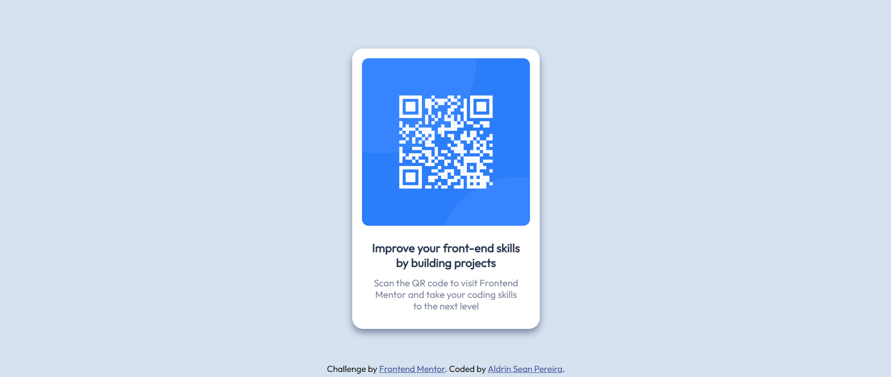

# Frontend Mentor - QR code component solution

This is a solution to the [QR code component challenge on Frontend Mentor](https://www.frontendmentor.io/challenges/qr-code-component-iux_sIO_H). The challenges help you improve your coding skills by building realistic projects. 

## Table of contents

- [Overview](#overview)
  - [Screenshot](#screenshot)
  - [Links](#links)
- [My process](#my-process)
  - [Built with](#built-with)
  - [What I learned](#what-i-learned)
  - [Continued development](#continued-development)
  - [Useful resources](#useful-resources)
- [Author](#author)
- [Acknowledgments](#acknowledgments)

## Overview

### Screenshot



### Links

- Solution/Code URL: [link](https://github.com/AldrinSeanPereira/QR-code-component/tree/main)
- Live Site URL: [link](https://loquacious-raindrop-73775c.netlify.app/)

## My process

### Built with

- Semantic HTML5 markup
- CSS custom properties
- Flexbox

### What I learned

I faced a lot of struggle but 2 stood out:
- not knowing where to write HTML + CSS
- was unable to understand the starter README.md file

I immediately went to the discord `help` section and specifically asked these 2 points. The support team there was super helpful and I cant thank them enough.

I still did face a lot of struggle with actually using VS Code and organising the files to see or do any changes. So I had to search how to use VS Code and write HTML + CSS in it.

Interesting pieces of code for me:

```html
<link href='https://fonts.googleapis.com/css?family=Outfit' rel='stylesheet'>
```

```css
.card {
    display: flex;
    flex-direction: column;
    justify-content: center;
    align-items: center;
    background-color: var(--white);
    border-radius: 1.5rem;
    width: 23rem;
    padding: 1.3rem;
    text-align: center;
    box-shadow: 0 5px 10px 0 var(--grayish-blue);
}
```

### Continued development

So far I have done the freeCodeCamp Responsive Web Design certification and this project.

I will continue on the projects in the discord channel `Challenge-roadmaps` offered by FrontendMentor

### Useful resources

- How to use Visual Studio Code to write HTML + CSS 
  - [Visual Studio Code tutorial](https://www.youtube.com/watch?v=yjeHLSrhPao) - This one is a bit long but extremely helpful throughout your career
  - [Live Server extension tutorial](https://www.youtube.com/watch?v=_Tl-6HeV0Rc&t) - We see the result of our HTML,CSS, JavaScript so we need to use this tutorial

- To understand how to edit the README.md [use this](https://www.markdownguide.org/)
- To submit your code on GitHub and show the website live [use this](https://medium.com/frontend-mentor/a-complete-guide-to-submitting-solutions-on-frontend-mentor-ac6384162248)

## Author

- Frontend Mentor - [@AldrinSeanPereira](https://www.frontendmentor.io/profile/AldrinSeanPereira)
- LinkedIn - [@yourusername](https://www.twitter.com/yourusername)
- GitHub - [@AldrinSeanPereira](https://github.com/AldrinSeanPereira)

## Acknowledgments

I owe the start of this journey to the wonderful guidance of Vikram and Steven from the freeCodeCamp forum 

And for all the support getting started on this first project, I thank Alex K Marshall from the support team in the `help section` of Frontend Mentor.

